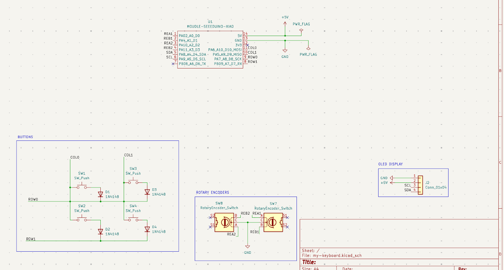
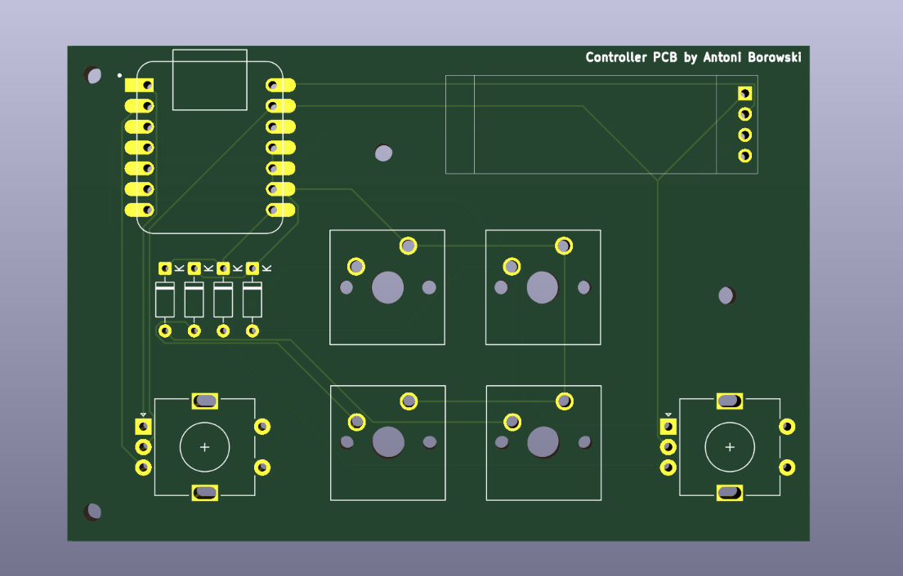

# Controller-for-marsian-rovers

Controller for marsian rovers is a 4 key macropad with a 2 rotary encoders and OLED Dispaly. It uses KMK firmware.
It will be used soon in my mars rover project as a control pad!

## Features:
  - 3D printed case with big hole to see this beautiful PCB
  - 128x32 OLED Display
  - EC11 Rotary encoders for steering the rover and preying to don't hurt the rover
  - 4 keys for some future functions of rover

## CAD Model
Everything fits together using 8 M3 Bolts. 4 for the case, 4 for the PCB. It was made in Fusion360.

## PCB
The controller PCB was made in KiCad ( It was my first time ). The hardest thing it this was to add 3D models :c 

Schematic

PCB

## Firmware Overview
This hackpad uses [KMK](https://github.com/KMKfw/kmk_firmware) firmware for everything. 
  - the rotary encoders acts like arrows in keyboard
  - 4 keys for now is only function keys for steering rover
  - the OLED in the future will present you some stats from rover!!!

## Extra stuff
[Click here to get a free Claude AI subscription for a year](https://www.youtube.com/watch?v=dQw4w9WgXcQ&list=RDdQw4w9WgXcQ&start_radio=1)
